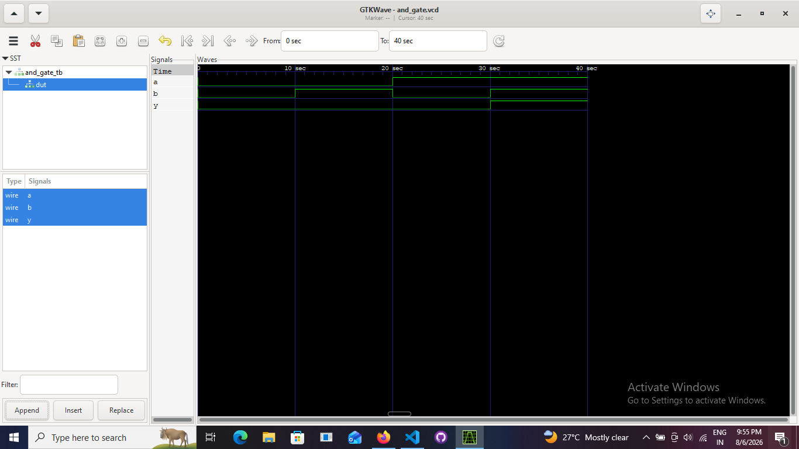
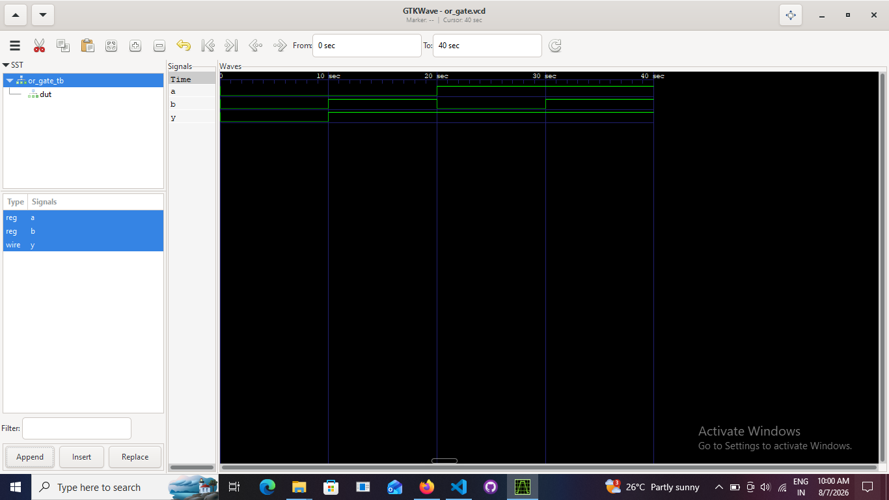
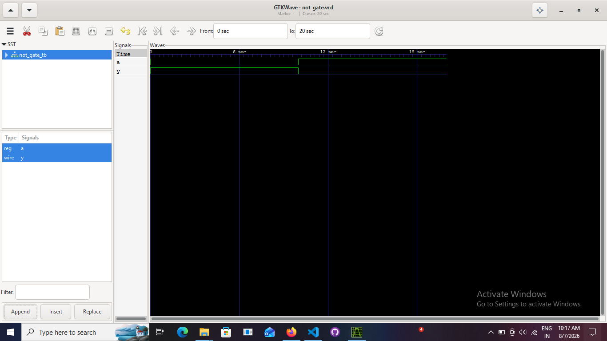
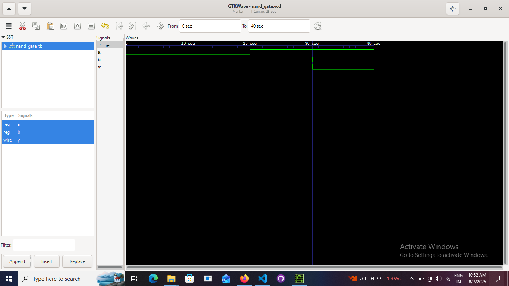

#  Verilog Logic Gates -- RTL Design & Verification

> **A beginner-to-engineering journey through Verilog HDL, RTL design,
> verification, simulation, and waveform analysis.**


------------------------------------------------------------------------

#  Overview

This repository contains the design and verification of the **seven
fundamental logic gates** using **Verilog HDL**.

Unlike a typical lab exercise, this project follows a complete **RTL
design and verification workflow**:

1.  Understand the digital logic.
2.  Write synthesizable RTL.
3.  Develop an independent testbench.
4.  Simulate the design.
5.  Analyze waveforms.
6.  Verify functionality against the truth table.

The goal is to build a strong foundation for **SystemVerilog**, **UVM**,
and **RTL Verification Engineering**.

------------------------------------------------------------------------

#  Objectives

-   Learn Verilog HDL from first principles.
-   Understand RTL design methodology.
-   Learn how verification differs from design.
-   Practice writing reusable testbenches.
-   Learn simulation and waveform debugging.
-   Build an interview-ready GitHub portfolio.

------------------------------------------------------------------------

#  Tools

  Tool                 Purpose
  -------------------- --------------------------
  Verilog HDL          RTL Design
  Icarus Verilog       Compilation & Simulation
  GTKWave              Waveform Analysis
  Visual Studio Code   Development
  Git & GitHub         Version Control

------------------------------------------------------------------------

#  Repository Structure

``` text
01_logic_gates/
│
├── rtl/
│   ├── and_gate.v
│   ├── or_gate.v
│   ├── not_gate.v
│   ├── nand_gate.v
│   ├── nor_gate.v
│   ├── xor_gate.v
│   └── xnor_gate.v
│
├── tb/
│   ├── and_gate_tb.v
│   ├── or_gate_tb.v
│   ├── not_gate_tb.v
│   ├── nand_gate_tb.v
│   ├── nor_gate_tb.v
│   ├── xor_gate_tb.v
│   └── xnor_gate_tb.v
│
├── docs/
├── waveforms/
└── README.md
```

------------------------------------------------------------------------

#  Implemented Gates

  Logic Gate    RTL   Testbench   Simulated   Verified
  ------------ ----- ----------- ----------- ----------
  AND           ✅       ✅          ✅          ✅
  OR            ✅       ✅          ✅          ✅
  NOT           ✅       ✅          ✅          ✅
  NAND          ✅       ✅          ✅          ✅
  NOR           ✅       ✅          ✅          ✅
  XOR           ✅       ✅          ✅          ✅
  XNOR          ✅       ✅          ✅          ✅

------------------------------------------------------------------------

#  Verification Flow

``` text
Truth Table
     │
     ▼
RTL Design
     │
     ▼
Testbench Development
     │
     ▼
Compilation (iverilog)
     │
     ▼
Simulation (vvp)
     │
     ▼
Waveform Generation (.vcd)
     │
     ▼
GTKWave Analysis
     │
     ▼
Design Verified 
```

------------------------------------------------------------------------

#  Commands

Compile:

``` bash
iverilog -o output.out rtl/<gate>.v tb/<gate>_tb.v
```

Run:

``` bash
vvp output.out
```

View waveform:

``` bash
gtkwave <gate>.vcd
```

------------------------------------------------------------------------

#  Waveforms


  Gate   Waveform
  ------ ---------------------------------------
  AND    
  OR     
  NOT    
  NAND   
  NOR    
  XOR    
  XNOR   

------------------------------------------------------------------------

#  Verilog Concepts Practiced

-   Modules
-   Ports
-   Continuous assignment (`assign`)
-   Bitwise operators
-   Module instantiation
-   `reg` vs `wire`
-   `initial` blocks
-   Delays (`#`)
-   `$monitor`
-   `$dumpfile`
-   `$dumpvars`
-   `$finish`

------------------------------------------------------------------------

#  Verification Concepts Practiced

-   Design Under Test (DUT)
-   Testbench architecture
-   Functional verification
-   Truth-table validation
-   Stimulus generation
-   Waveform inspection
-   Debugging through simulation

------------------------------------------------------------------------

#  Learning Roadmap

-   ✅ Logic Gates
-   ⏳ Multiplexers
-   ⏳ Decoders & Encoders
-   ⏳ Adders & Subtractors
-   ⏳ Flip-Flops
-   ⏳ Counters & Registers
-   ⏳ FSM Design
-   ⏳ SystemVerilog
-   ⏳ UVM

------------------------------------------------------------------------

#  About Me

**SAHIL RAJENDRA BACHHAV**\
Electronics & Telecommunication Engineering Student\
Aspiring **RTL Design & Verification Engineer**

I am building a project-based portfolio focused on digital design,
Verilog, SystemVerilog, and UVM, with the goal of contributing to the
semiconductor industry.

------------------------------------------------------------------------

## ⭐ If you found this project useful, consider giving it a star.
